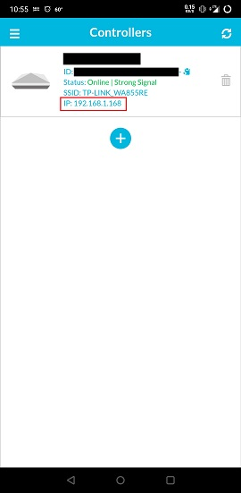
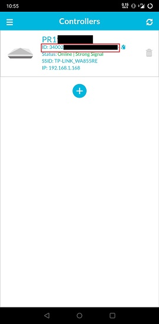
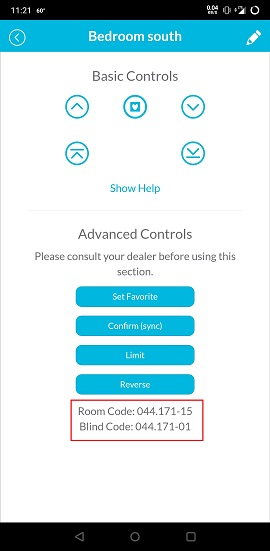
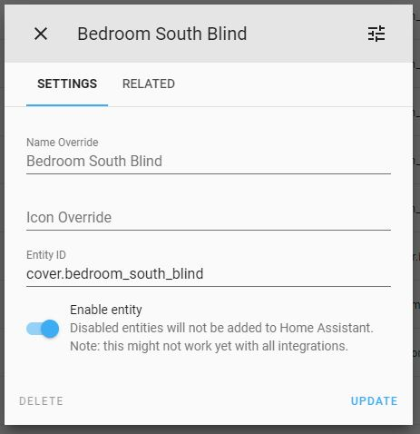
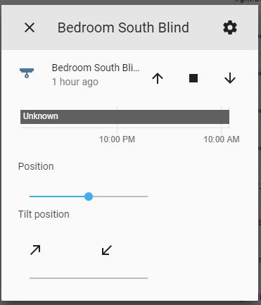
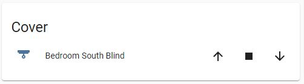

# NeoSmartBlinds Home Assistant Integration

Control NeoSmartBlinds covers locally via a NeoSmartBlinds controller. This integration is UI-first and configured entirely from the Home Assistant interface (no configuration.yaml required).

This integration is based on https://github.com/mtgeekman/Home_Assistant_NeoSmartBlinds/ with extensive improvements and modernization.

## Features

- Cover entity with open, close, stop, position, and tilt controls
- HTTP or TCP transport
- Optional top-down/bottom-up rail selection
- Per-cover position estimation using close time
- Group command aggregation via parent group
- Connection validation during setup
- Services for favorites and position sync

## Requirements

- NeoSmartBlinds controller on your local network
- Static IP or DHCP reservation for the controller
- Controller ID (hub_id) and blind_code from the Neo Smart Blinds app

## Installation

### HACS (recommended)

1. Add this repository to HACS as a custom repository.
2. Install the integration.
3. Restart Home Assistant.

### Manual

1. Copy the neosmartblinds folder from custom_components to your Home Assistant config/custom_components folder.
2. Restart Home Assistant.

## Setup (UI)

Go to Settings -> Devices & Services -> Add Integration -> NeoSmartBlinds.

### First cover

Fill in all fields. The controller information is required for the first entry.

### Additional covers on the same hub

The host and hub_id fields are pre-filled from your first entry. You only need to change name and blind_code (plus any per-blind options like motor_code or rail).

## Configuration Fields

- name: Friendly name shown in Home Assistant.
- host: Controller IP address.
- hub_id: Controller ID from the Neo Smart Blinds app.
- blind_code: Blind or room code from the Neo Smart Blinds app.
- protocol: http or tcp.
- port: 8838 for HTTP, 8839 for TCP.
- close_time: Seconds to fully close the blind (used for position estimation).
- rail: 1 (top), 2 (bottom), or 3 (both rails for supported motors).
- percent_support: 0 (favorites only), 1 (direct percent), 2 (estimated percent).
- motor_code: Motor protocol code shown in the app (required for some hubs).
- start_position: Initial position on HA startup when percent_support is enabled.
- parent_group: Room/group code for optional command aggregation.
- tilt_support: Show or hide tilt controls in the UI.
- io_timeout: Network timeout per request.
- command_backoff: Minimum delay between commands.
- command_aggregation: Window for aggregating group commands.
- retry_count: Number of retries for a failed request.
- retry_delay: Delay between retries.
- debug_logging: Enable extra debug logs for this entry.

## Options (Edit Entry)

Open the integration entry and select Configure (gear icon) to edit all fields. Updating name will also update the entry title in the UI list.

## Services

- neosmartblinds.set_favorite
  - favorite: 1 or 2
- neosmartblinds.sync_position
  - position: 0 or 100

## Positioning Behavior

The hub does not report current position, so Home Assistant estimates it.

Percent Support Modes:

- 0: Favorites only
  - Position 50 -> favorite 1
  - Position 51 -> favorite 2
- 1: Hub handles percent commands
  - Position slider sends percent to hub
  - Tilt slider selects favorites (<50 for favorite 1, >50 for favorite 2)
- 2: Integration estimates percent and issues stop
  - Position slider uses close_time to estimate
  - Tilt slider selects favorites (<50 for favorite 1, >50 for favorite 2)

## Limitations

- No auto-discovery of blinds (protocol does not expose device listing)
- State is assumed; external control can desync position

## Screenshots

